# Sales Department Hierarchy - Manual Test Plan

## 🔐 Test Accounts (Password: `Password@123`)

```mermaid
graph TD
    A["🔴 Admin<br/>superadmin@media-masala.com<br/>Scope: ALL"] --> HOD
    HOD["🟠 Sales HOD<br/>sales.hod@test.com<br/>Scope: DEPARTMENT"] --> BM
    BM["🟡 Sales BM<br/>sales.bm@test.com<br/>Scope: TEAM"] --> BDM1
    BM --> BDM2
    BDM1["🟢 Sales BDM-1<br/>sales.bdm1@test.com<br/>Scope: TEAM"] --> BDE1A & BDE1B & BDE1C & BDE1D
    BDM2["🟢 Sales BDM-2<br/>sales.bdm2@test.com<br/>Scope: TEAM"] --> BDE2A & BDE2B & BDE2C & BDE2D
    BDE1A["🔵 BDE-1A<br/>sales.bde1a@test.com<br/>10 Leads"]
    BDE1B["🔵 BDE-1B<br/>sales.bde1b@test.com<br/>10 Leads"]
    BDE1C["🔵 BDE-1C<br/>sales.bde1c@test.com<br/>10 Leads"]
    BDE1D["🔵 BDE-1D<br/>sales.bde1d@test.com<br/>10 Leads"]
    BDE2A["🔵 BDE-2A<br/>sales.bde2a@test.com<br/>10 Leads"]
    BDE2B["🔵 BDE-2B<br/>sales.bde2b@test.com<br/>10 Leads"]
    BDE2C["🔵 BDE-2C<br/>sales.bde2c@test.com<br/>10 Leads"]
    BDE2D["🔵 BDE-2D<br/>sales.bde2d@test.com<br/>10 Leads"]
```

---

## 🔵 Test 1: BDE (Bottom Level — OWN scope)

> **Login as:** `sales.bde1a@test.com`

| # | Module | What to Check | Expected |
|---|--------|--------------|----------|
| 1 | **Leads** | View leads list | Only 10 leads visible: `Lead-BDE1A-01` to `Lead-BDE1A-10` |
| 2 | **Leads** | Check for other BDE leads | `Lead-BDE1B-*` or `Lead-BDE2A-*` should NOT be visible |
| 3 | **Attendance** | View attendance | Only own attendance records |
| 4 | **Attendance** | Check for filters | Department/Employee filter dropdowns should NOT appear |
| 5 | **EOD** | View EOD reports | Only own EOD reports |
| 6 | **EOD** | Submit EOD | Can submit own EOD report |

> **Then login as:** `sales.bde2c@test.com` — Verify same behavior but with `Lead-BDE2C-*` leads only.

---

## 🟢 Test 2: BDM (Team Manager — TEAM scope)

> **Login as:** `sales.bdm1@test.com`

| # | Module | What to Check | Expected |
|---|--------|--------------|----------|
| 1 | **Leads** | View leads list | 40 leads visible: all `Lead-BDE1A-*`, `BDE1B-*`, `BDE1C-*`, `BDE1D-*` |
| 2 | **Leads** | Check for BDM-2's team leads | `Lead-BDE2A-*` through `BDE2D-*` should NOT be visible |
| 3 | **Attendance** | View attendance | Own + BDE-1A, 1B, 1C, 1D records visible |
| 4 | **Attendance** | Use Employee filter | Dropdown shows only: BDM-1, BDE-1A, BDE-1B, BDE-1C, BDE-1D |
| 5 | **Attendance** | Filter by BDE-1A | Only BDE-1A's attendance records shown |
| 6 | **EOD** | View EOD reports | Own + team members' reports |
| 7 | **EOD** | Filter by BDE-1C | Only BDE-1C's reports shown |

> **Then login as:** `sales.bdm2@test.com` — Same tests, but should see `Lead-BDE2A-*` through `BDE2D-*` (40 leads), NOT BDM-1's team.

---

## 🟡 Test 3: BM (Business Manager — TEAM scope, recursive)

> **Login as:** `sales.bm@test.com`

| # | Module | What to Check | Expected |
|---|--------|--------------|----------|
| 1 | **Leads** | View leads list | ALL 80 leads visible (recursive: BDM1 + BDM2 + all 8 BDEs are reportees) |
| 2 | **Leads** | Filter by Employee (BDE-1A) | Only 10 `Lead-BDE1A-*` leads |
| 3 | **Leads** | Filter by Employee (BDM-2) | Only BDM-2's own leads (may be 0 if BDM has no leads) |
| 4 | **Attendance** | View attendance | Own + all 10 team members' records |
| 5 | **Attendance** | Use Employee filter | Dropdown shows: BM, BDM-1, BDM-2, BDE-1A through BDE-2D (11 people) |
| 6 | **Attendance** | Filter by BDE-2D | Only BDE-2D's attendance |
| 7 | **EOD** | View EOD reports | Can see reports from all 10 reportees |
| 8 | **Reports** | Generate report | Report covers all team data |

---

## 🟠 Test 4: HOD (Department Head — DEPARTMENT scope)

> **Login as:** `sales.hod@test.com`

| # | Module | What to Check | Expected |
|---|--------|--------------|----------|
| 1 | **Leads** | View leads list | ALL 80 leads visible (entire Sales Department) |
| 2 | **Leads** | Use Dept filter | "Sales Department" should be pre-selected or the only option |
| 3 | **Leads** | Filter by Employee (BDE-2A) | Only 10 `Lead-BDE2A-*` leads |
| 4 | **Attendance** | View attendance | All Sales Department employees visible |
| 5 | **Attendance** | Use Employee filter | All 12 Sales employees in dropdown |
| 6 | **Attendance** | Filter by BDE-1D | Only BDE-1D's attendance |
| 7 | **Projects** | View projects | All Sales Department projects |
| 8 | **Leaves** | View leaves | All Sales Department leave requests |

---

## 🔴 Test 5: Admin (Super Admin — ALL scope)

> **Login as:** `superadmin@media-masala.com`

| # | Module | What to Check | Expected |
|---|--------|--------------|----------|
| 1 | **Leads** | View leads list | ALL 80+ leads (across all departments) |
| 2 | **Leads** | Use Dept filter | Can select any department |
| 3 | **Leads** | Filter by "Sales Department" | Only Sales leads (80) |
| 4 | **Attendance** | View attendance | All employees from all departments |
| 5 | **Attendance** | Filter Dept = Sales, Emp = BDE-1A | Only BDE-1A's records |
| 6 | **Settings** | Manage Employees | Can see and edit all employees |
| 7 | **Settings** | Change permissions | Can modify role permissions |

---

## 🧪 Test 6: Security / Negative Tests

| # | Test | Steps | Expected |
|---|------|-------|----------|
| 1 | **BDE can't see peer's leads** | Login as BDE-1A, manually change URL to BDE-1B's lead ID | 403 Forbidden or redirect |
| 2 | **BDM-1 can't see BDM-2's team** | Login as BDM-1, filter employee = BDE-2A | BDE-2A should not appear in dropdown |
| 3 | **BDE can't approve leaves** | Login as BDE, try to approve a leave | Button should not exist or return 403 |
| 4 | **API bypass attempt** | Login as BDE-1A, call API with `?employeeId={BDE-2A-id}` | API returns only BDE-1A's data (ignores param) |
